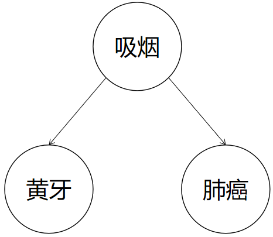

# Peter-Clark-Algorithm

#### 前言

备战考研的日子还历历在目，然而那段时光早已离去甚远了（emmm...也就一年）。总有人说2020这一年是一段难忘的光阴，然而在2020年9月研究生生涯开始之前，脑海里只留下了一些零星的碎片，高强度抗疫的日子里没有什么起伏，几乎都只是在卧室里来回踱步（没有一坐一整天然而我还是胖了很多很多），每天盼望的就是新增病例的数量比前一天少，疫情逐步控制下来，然后我和亲人朋友们在鲜花盛开的季节里重逢。然而生活不是电影，疫情夺走了我的毕业典礼，夺走了我的毕业旅游，还夺走了我的腰线。

研究生开学以后生活开始步入正轨，开始做一些像样的东西，重新恢复了学生的身份，开始踏上因果的科研之路。

#### 关于因果的一丢丢陈述

互联网、生命科学、经济学等领域积累的海量数据蕴含着巨大的商业价值和极其丰富的科学发现机会，有效探索和利用这些数据已经成为各个领域的 迫切需求。在经济领域，已有研究报告表明利用数 据科学指导决策可以提高至少５％的生产效率。在科学研究领域，基于“将数据放入计算机集群，让统计算法去发现科学家不能发现的规律”思想的数 据密集型科学发现已经成为科学研究的第四范式。

因果关系体现的是事物之间随着时间互相作用的一个客观存在的过程，如何从数据中发现其蕴藏的内在因果关系。简单举一个例子，如下图所示，吸烟、黄牙与肺癌有着紧密的相关关系，从内在的机理得出吸烟是肺癌的原因，用戒烟千预可以降低肺癌的发病率，而通过刷牙干预方式是无法降低肺癌的发病率。除此以外，还有许多其他类似的医学案例能够体现因果发现的价值，通过大量的基因数据与致病症状构建因果关系，可以提高对疾病的及时预防能力。

近期，因果关系发现得到了更多CS届大牛的青睐，在此方向上的探索正经历着“螺旋上升”中的快速上升阶段，期待有更多的道友一起探索因果领域，共同交流学习！

####  关于此代码

* 此代码为对因果关系发现的经典算法之PC算法的Python实现；
* PC算法简而言之就是：1. 砍去部分边，学得骨架；2. 根据V结构和定向规则进行定向。由于生成数据为线性非高斯数据，代码中使用偏相关系数来做节点之间的条件独立性检测；
* 代码包括：实验数据生成、PC算法、算法结果评估等功能；
* 代码结构借鉴于前辈Renovaman复现的PC算法，在前辈的代码基础上做了功能添加以及DEBUG；
* 本人水平有限，BUG在所难免，还请大佬批评指正；
* 代码仅供交流学习，如有冒犯，还请见谅。

#### 参考资料：

[1] Spirtes, P., Glymour, C. N., Scheines, R., & Heckerman, D. (2000). *Causation, prediction, and search*. MIT press.

[2] 蔡瑞初, 陈薇, 张坤, & 郝志峰. (2017). 基于非时序观察数据的因果关系发现综述. *计算机学报*, *40*(6), 1470-1490.

[3] Wikipedia contributors. (2021, February 19). Partial correlation. In *Wikipedia, The Free Encyclopedia*. Retrieved 12:36, April 10, 2021, from https://en.wikipedia.org/w/index.php?title=Partial_correlation&oldid=1007631033